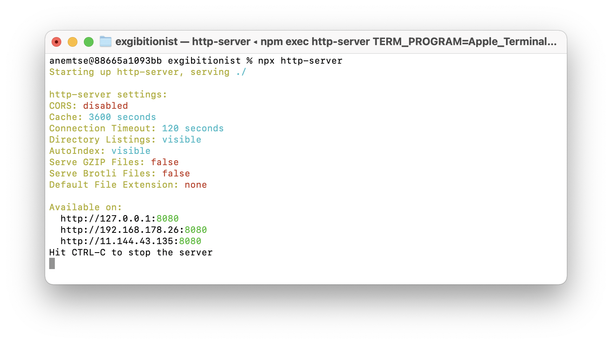

<p align="center">
  English |
  <a href="https://github.com/SilentImp/exgibitionist/blob/master/README.ru.md">Pусский</a>
</p>

# How to start presentation

```
npx http-server
```

Then open in browser http://127.0.0.1:8080
Port could be different. 
Use URL, that you see in the terminal, after command execuition.

# Presentation controls

| Description                      | Key                                                     |
| :------------------------------- | ------------------------------------------------------- |
| Next slide                       | Right arrow, keys L and J, PgDown, Tab                  |
| Previous slide                   | Left arrow, keys H and K, PgUp, Shift+Tab               |
| Select slide                     | Click on slide                                          |
| Go fullscreen                    | Enter (when slide focused), doubleclick on slide        |
| Exit fullscreen                  | ESC or Enter                                            |
| Show go to slide form            | P                                                       |
| Hide go to slide form            | ESC or P                                                |
| Switch to captions or teletype   | C                                                       |
| Turn off slide number sync across tabs | B                                                 |

