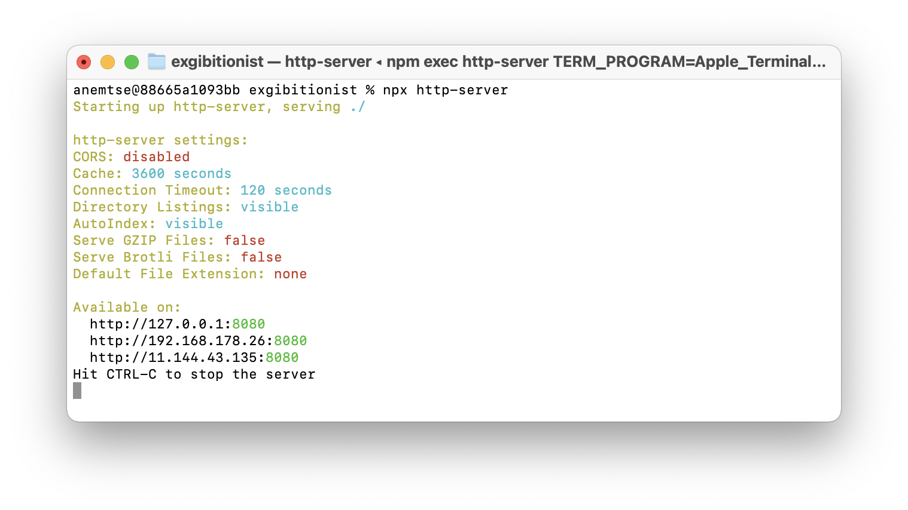

<p align="center">
  <a href="https://github.com/SilentImp/exgibitionist/blob/master/README.md">English</a> |
  Pусский
</p>

# Запуск презентации

```
npx http-server
```

Затем откройте в браузере http://127.0.0.1:8080
Порт может быть другим. 
Используйте URL, который видете в терминале, после выполнения команды.

# Управление презентацией

| Назначение                       | Клавиша                                                 |
| :------------------------------- | ------------------------------------------------------- |
| Следующий слайд                  | Стрелки вправо, клавиши L и J, PgDown, Tab              |
| Предыдущий слайд                 | Стрелки влево, клавиши  H и K, PgUp, Shift+Tab          |
| Выбрать слайд                    | Клик по слайду                                          |
| Включить полноэкранный режим     | Enter (когда фокус на слайде), двойной щелчек по слайду |
| Выключить полноэкранный режим    | ESC или Enter                                           |
| Показать форму перехода к слайду | P                                                       |
| Cкрыть форму перехода к слайду   | ESC или P                                               |
| Сменить режим отображения телетекста или телесуфлера | C                                   |
| Отключтиь синхронизацию слайдов в разных табах | B                                         |

